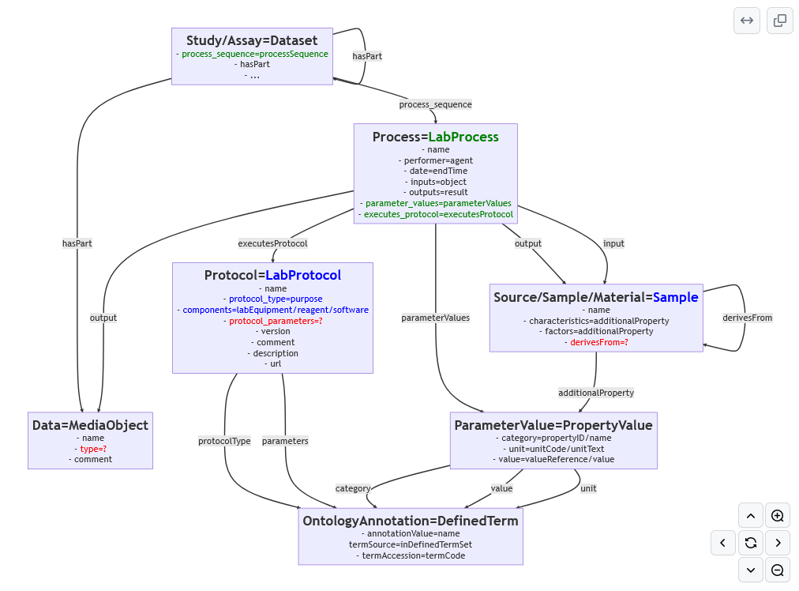

# Introduction

As part of the BioHackathon Europe 2023, we report here on the plan that project group #14 initially had, as well as the deviations from this plan during the event. 

## Description of Project 14

A prevailing paradigm in Research Data Management (RDM) is to publish research datasets in designated archives upon conclusion of a research process. However, it is beneficial to abandon the notion of **final** or **static** data artifacts and instead adopt a continuous approach towards working with research data, where data is constantly archived, versioned, and updated. This **immutable yet evolving** perspective allows for the application of existing technologies and processes from software engineering, such as continuous integration, release practices, and version management backed by decades of experience, and adaptable to RDM.

To facilitate this, we propose the Annotated Research Context (ARC), a data and metadata layout convention based on the well-established ISA model for metadata annotation [@citesAsAuthority:Rocca_Serra2010] and implemented as Git repositories. ARCs are amenable towards frequent, lightweight data management operations, such as (meta)data validation and transformation. The Omnipy Python library is designed to help develop stepwise validated (meta)data transformations as scalable data flows that can be incrementally designed, updated, and rerun as requirements or data evolve.

To demonstrate the concept of **continuous RDM** we will use Omnipy to define and orchestrate Git-backed CI/CD (Continuous Integration/Continuous Delivery) data flows to convert ISA metadata present in ARCs into validated RO-Crate [@citesAsAuthority:10.3233/ds-210053] representations adhering to the Bioschemas [@citesAsAuthority:gray2017] convention. A RO-Crate package combines the actual research data with its metadata description. Downstream, this allows semantic interpretation by Galaxy for e.g. workflow execution as well as machine-readable data access and data harvesting for search engines such as FAIDARE.

**Initial Work Plan**

1. Generate Bioschemas representation of the ISA model
2. Specify formal RO-Crate Profile for ISA
3. Extend existing CI/CD workflow for ARC/ISA using Omnipy and whyqd
4. (Bonus objective: Finalise MIAPPE [@citesAsAuthority:Papoutsoglou2020] to ISA-JSON [@citesAsAuthority:arend2023] mapping)

# Results

Actual results produced during discussions, modelling and implementations during the BioHackathon Europe 2023.

## Changes from the original work plan

In preparation for the BioHackathon, the team from Kaiserslautern had already implemented a prototype of a CI/CD pipeline for ARCs in a GitLab environment [ARC_Prototype](https://git.nfdi4plants.org/muehlhaus/ArcPrototype) [@citesAsAuthority:Weil2023]. This allowed us to focus on the converting ISA to RO-Crate using Bioschemas and Schema.org. What we wanted to achieve in this conversion was that the process should be reversible, i.e. without loss of information on either side of the conversion. For use cases that require a more powerful computing environment (cloud), it was decided to integrate Omnipy orchestration into GitLab.

All these changes from the original work plan allowed to define additional work to create a crosswalk from ISA to GEO using whyqd. During the BioHackathon it also became clear that the mappings between ISA and MIAPPE need to be refined to fully utilise the conversion from MIAPPE-compliant ISA to RO-Crates.

**Updated Work Plan**
1. Generate Bioschemas representation of the ISA model
2. Specify formal RO-Crate Profile for ISA
3. Generate Crosswalk from ISA to GEO using whyqd
4. Redo and refine MIAPPE to ISA mapping
5. Integration of CI/CD-triggered dataflows using Omnipy in cloud environments

## Bioschemas
For a correct and lossless conversion from ISA to RO-Crate, adherence to Schema.org or Bioschemas annotations is crucial. While most of the ISA data model aligns with these annotations, an exception arises with the 'LabProtocol' instance. In Bioschemas, 'LabProtocol' is mainly interpreted as the execution process, evident in its relation to https://schema.org/CreativeWork (refer to https://bioschemas.org/profiles/LabProtocol/0.7-DRAFT). However, Bioschemas does not define the associated instruction or documentation for this execution, leaving a gap in its scope.

In contrast, the ISA data model meticulously defines both the process and its corresponding instruction. This difference poses a challenge in the conversion from ISA to RO-Crate, as the absence of a well-defined instruction in the Bioschemas scope complicates or renders impossible alignment with the robust definitions present in the ISA data model. 

Following the realization of these challenges, immediate contact was made with the Bioschemas Steering Council, with several members, including Leyla Jael Castro, Ivan Mičetić, Alban Gaignard, Nick Juty, and Ginger Tsueng, actively participating either physically or virtually in the BioHackathon. Our observations were communicated, and discussions ensued regarding potential solutions. In collaboration, a decision was reached to establish a working group aimed at creating a new type and profile for 'LabProcess' while refining the type and profile for 'LabProtocol'.

The envisioned future approach involves redefining 'LabProtocol' as a child of 'HowTo' (https://schema.org/HowTo), providing clear alignment with the documentation and instruction of laboratory processes. Simultaneously, the working group proposed defining 'LabProcess' as a child of 'Action' (https://schema.org/Action) in future iterations. This definition would encompass the implementation or execution of instructions, allowing for potential adaptations and characterizations within this context.

**LabProcess Draft Type**

*Schema.org hierarchy*

This is a new Type that fits into the schema.org hierarchy as follows: [Thing](http://schema.org/Thing) > [Action](https://schema.org/Action) > LabProcess

***Description***

A LabProcess represents the specific application of a LabProtocol to some input material (a sample or a source) to produce some output (sample, source or data file).

***Properties***

| Property | Expected Type | Description |
| -------- | -------- | -------- |
| **Properties of LabProcess**  |
| parameterValue     | [PropertyValue](https://schema.org/PropertyValue)     | A parameter value of the experimental process, usually a key-value pair using ontology terms.     |
| executesLabProtocol | LabProtocol | The protocol describes the process instance and its parameters. |
| comment | [Comment](https://schema.org/Comment) | Comments |
| **Properties of Action** |
| object | [Sample](https://bioschemas.org/types/Sample/0.2-DRAFT-2018_11_09) of [MediaObject](https://schema.org/MediaObject) | The input of the process. |
| result | [Sample](https://bioschemas.org/types/Sample/0.2-DRAFT-2018_11_09) of [MediaObject](https://schema.org/MediaObject) | The output of the process. |
| agent | [Person](https://schema.org/Person) or [Organization](https://schema.org/Organization) | The performer of the experiment. |
| endTime | [Date](https://schema.org/Date) | The time the experiment was executed. |
| **Properties of Thing** |
| name | [Text](https://schema.org/Text) | A name describing the experimental process. |

**LabProtocol Draft Type**

*Schema.org hierarchy*

This is a new Type that fits into the schema.org hierarchy as follows: [Thing](http://schema.org/Thing) > [CreativeWork](https://schema.org/CreativeWork) > [HowTo](https://schema.org/HowTo) > LabProtocol

***Description***

A LabProtocol represents the specification of how to perform a Lab based process.

***Previous Type***

Previous version: [0.3-DRAFT-2019_06_20 (2019-06-20)](https://bioschemas.org/types/LabProtocol/0.3-DRAFT-2019_06_20)

***Properties***

| Property | Expected Type | Description |
| -------- | -------- | -------- |
| **Properties of LabProtocol** |
| labEquipment     | [DefinedTerm](http://pending.schema.org/DefinedTerm) or [Text](http://schema.org/Text) or [URL](http://schema.org/URL)| A laboratory equipment used by a person to follow one or more steps described in this LabProtocol.|
| software | [SoftwareApplication](http://schema.org/SoftwareApplication) | Software or tool used as part of the lab protocol to complete a part of it. |
| reagent | [BioChemEntity](https://bioschemas.org/BioChemEntity) or [DefinedTerm](http://pending.schema.org/DefinedTerm) or [Text](http://schema.org/Text) or [URL](http://schema.org/URL) | Reagent used in the protocol. It can be a record in a Dataset describing the reagent or a BioChemEntity corresponding to the reagent or a URL pointing to the type of reagent used. |
| purpose | [MedicalDevicePurpose](http://schema.org/MedicalDevicePurpose) or [Text](http://schema.org/Text) or [Thing](http://schema.org/Thing) | A goal towards an action is taken. Can be concrete or abstract. |
| **Properties of HowTo** |
| **Properties of CreativeWork** |
| version | [Number](https://schema.org/Number) or [Text](https://schema.org/Text) | The version of the CreativeWork embodied by a specified resource. |
| comment | [Comment](https://schema.org/Comment) | Comments by the creator/performer. |
| **Properties of Thing** |
| name | [Text](https://schema.org/Text) | A name describing the protocol. |
| description | [Text](https://schema.org/Text) or [TextObject](https://schema.org/TextObject) | A short description of the steps to be performed. |
| url | [URL](https://schema.org/URL) | URL of the item. |
| sameAs | [URL](https://schema.org/URL) | URL of a reference Web page or file that unambiguously indicates the item's identity. E.g. the URL of the item's Wikipedia page, Wikidata entry, or official website. |

## RO-Crate Profiles to fully represent ISA

Discussions with the Bioschemas Steering Council revealed that the introduction of new types and profiles is a more time-consuming process than initially anticipated. At this juncture, it became evident that the BioHackathon would conclude without a finalized RO-Crate profile for ISA. Nonetheless, in light of this, a decision was made to develop a ISA RO-Crate profiles using our draft types. As discussed previously the decision was made to generate multiple profiles for all the layers of ISA (namely Investigation, Study, Assay) [@citesAsAuthority:arend2022biohackeu22].

Taking inspiration from the [ISA Draft Profile](https://www.researchobject.org/ro-crate/profiles.html#isa-investigation-profile) (that only includes the Investigation part until now), we used it as a foundational starting point and proceeded to extend and adapt it to align with our envisioned ISA RO-Crate profile. In this process we added Study, Assay, LabProcess, LabProtocol, Sample, Data, and PropertyValue to it.

***Investigation***

| Property | Required? | Description |
| -------- | -------- | -------- |
| @type    | MUST    | Dataset    |
| @id | MUST | Should be “./”, the investigation object represents the root data entity. |
| [additionalType]() | MUST | ‘Investigation’ or ontology term to identify it as an Investigation |
| headline | MUST | Text - A title of the investigation (e.g. a paper title). |
| creator | MUST | Person - The creator(s)/authors(s)/owner(s)/PI(s) of the investigation. |
| identifier | MUST | Text or URL - Identifying descriptor of the investigation (e.g. repository name). |
| description | SHOULD | Text - A description of the investigation (e.g. an abstract). |
| hasPart | SHOULD | An Investigation object should contain other datasets representing the **studies** of the investigation. | 
| dateCreated | SHOULD | DateTime |
| dateModified | SHOULD | DateTime |
| datePublished | SHOULD | DateTime |
| citation | COULD | ScholarlyArticle - Publications corresponding with this investigation. |
| comment | COULD | Comment |
| mentiones | COULD | DefinedTermSet - Ontologies referenced in this investigation. |

***Study***

| Property | Required? | Description |
| -------- | -------- | -------- |
| @type    | MUST    | Dataset    |
| @id | MUST | Should be a subdirectory corresponding to this study. |
| [additionalType]() | MUST | ‘Study’ or ontology term to identify it as a Study |
| creator | MUST | Person - The performer of the study. |
| identifier | MUST | Text or URL - Identifying descriptor of the study. |
| headline | MUST | Text - A title of the study. |
| hasPart | SHOULD | Dataset (**Assays**) and/or File - Assays contained in this study or actual data files resulting from the process sequence. |
| *processSequence* | SHOULD | LabProcess - The experimental processes performed in this study. |
| dateCreated | SHOULD | DateTime |
| dateModified | SHOULD | DateTime |
| datePublished | COULD | DateTime |
| dateEnd | COULD | DateTime |
| citation | COULD | ScholarlyArticle - A publication corresponding to the study. |
| comment | COULD | Comment |

***Assay***

| Property | Required? | Description |
| -------- | -------- | -------- |
| @type    | MUST    | Dataset    |
| @id | MUST |Should be a subdirectory corresponding to this assay. |
| *processSequence* | MUST | LabProcess - The experimental processes performed in this assay. |
| [additionalType]() | MUST | ‘Assay’ or ontology term to identify it as an Assay |
| creator | MUST | Person - The performer of the experiments. |
| identifier | MUST | Text or URL - Identifying descriptor of the assay. |
| measurementMethod | MUST | describes the type measurement e.g Complexomics or transcriptomics as an ontology term - URL or DefinedType |
| measurementTechnique | MUST | Describes the type of technology used to take the measurement, e.g mass spectrometry or deep sequencing - URL or DefinedType |
| description | SHOULD | A short description of the assay (e.g. an abstract) - Text |
| hasPart | SHOULD | The data files resulting from the process sequence - File. |
| variableMeasured | COULD | The target variable being measured E.g protein concentration - Text or PropertyValue |
| dateCreated | SHOULD | DateTime |
| dateModified | SHOULD | DateTime |
| citation | COULD | ScholarlyArticle - A publication corresponding to this assay. |
| comment | COULD | Comment |

***LabProcess***

| Property | Required? | Description |
| -------- | -------- | -------- |
| \@type    | MUST    | LabProcess    |
| \@id | MUST | Could identify the process using the isa metadata filename and the protocol reference or process name. |
| name | MUST | Text |
| agent | MUST | The performer - Person |
| object | MUST | The input - Sample, File |
| result | MUST | The output - File, Sample |
| executesLabProtocol | SHOULD | The protocol executed - LabProtocol |
| parameterValue | SHOULD | A parameter value of the experimental process, usually a key-value pair using ontology terms - PropertyValue |
| endTime | SHOULD | DateTime |

***LabProtocol***

| Property | Required? | Description |
| -------- | -------- | -------- |
| \@type    | MUST    | LabProtocol   |
| \@id | MUST | Could be the url pointing to the protocol resource. |
| url | MUST | Pointer to protocol resources external to the ISA-Tab that can be accessed by their Uniform Resource Identifier (URI). |
| headline | SHOULD | Main title of the LabProtocol. - Text |
| purpose | SHOULD | The protocol type as an ontology term - URL or DefinedType |
| description | SHOULD | A short description of the protocol (e.g. an abstract) |
| comment |COULD | Comment |
| version | COULD | An identifier for the version to ensure protocol tracking. |
| labEquipment | COULD | For LabProtocols it would be a laboratory equipment use by a person to follow one or more steps described in this LabProtocol. |
| reagent | COULD | Reagents used in the protocol. |
| software | COULD | Software or tool used as part of the lab protocol to complete a part of it. |
| sameAs | COULD | URL of a reference Web page that unambiguously indicates the item's identity. E.g. the URL of the item's Wikipedia page, Wikidata entry, or official website. |

***Sample***

| Property | Required? | Description |
| -------- | -------- | -------- |
| \@type    | MUST    | Sample   |
| \@id | MUST | Could be the unique sample name. |
| name | MUST | A name identifying the sample. |
| additionalProperty | SHOULD | characteristics or factors |
| *derivesFrom* | COULD | A source from which the sample is derived through processes. |

***Data***

| Property | Required? | Description |
| -------- | -------- | -------- |
| \@type    | MUST    | File   |
| \@id | MUST | Should be the path pointing to the file. |
| name | MUST | Text or URI - the name of the file. |
| comment | COULD | Comment |
| encodingFormat | COULD | Media format as a MIME type |
| disambiguatingDescription | COULD | Text - The type of the data file ("Raw Data File", "Derived Data File" or "Image File") |

***PropertyValue***

| Property | Required? | Description |
| -------- | -------- | -------- |
| \@type    | MUST    | PropertyValue   |
| \@id | MUST | |
| additionalType | COULD | Text - Can be used to describe if the value is a factor, characteristic or parameter. |
| propertyID | SHOULD | Key ontology reference - URL |
| name | MUST | Key name - Text |
| unitCode | COULD | Unit ontology reference - URL |
| unitText | COULD | Unit name - Text |
| valueReference | COULD | Value ontology reference - URL |
| value | MUST | Value text or number - Text |

## Crosswalks from ISA to GEO using whyqd
Our team tackled the challenge of converting ISA tab format files to GEO format using the whyqd tool for crosswalk. The core of our approach lay in a swiftly formulated crosswalk script, a set of instructions designed to handle crucial attributes for conversion. These scripts covered a range of transformations, from selecting library names to categorizing single or paired-end data, ensuring a comprehensive conversion process.

The primary hurdle we encountered was the diverse presentation of ISA data across multiple Excel files and sheets, lacking a predefined order. To overcome this challenge, our initial focus was on efficiently organizing and ordering the input tabular data. This step laid the groundwork for the subsequent phases of the conversion process.

Executing the schema-to-schema crosswalk using the whyqd tool was a pivotal step. Leveraging the formulated crosswalk script, we seamlessly transitioned the data from ISA to GEO format. This step not only ensured accuracy in the conversion but also provided a structured and standardized dataset, aligning with the GEO format.

The culmination of our efforts was the production of a combined output that served multiple purposes. This final step involved merging the results of the crosswalk process, delivering a cohesive dataset that met the requirements of the GEO format. Our approach, though streamlined, proved effective in handling the intricacies of ISA data, setting the stage for future endeavors in bioinformatics data conversion.

This is available as a Jupyter Notebook here: https://github.com/turukawa/coding-notes/blob/master/2023%20Biohackathon%20Europe%20-%20Whyqd%20conversion%20of%20ISA%20to%20GEO.ipynb

## MIAPPE to ISA 

During dedicated discussions, we delved into the harmonization between MIAPPE and ISA, uncovering two key insights:

In MIAPPE-compliant ISA, the placement of the StudyDesignDescriptor within the Investigation raised significant questions. Proposals surfaced to relocate it to a distinct Study, referencing it in other Studies, particularly the experimental ones. This adjustment aimed to prevent the current form of the Investigation from becoming overly burdened with StudyDesignDescriptors in the presence of numerous experimental Studies. Additionally, this approach was seen as instrumental in fostering the downstream development and reusability of these Studies in other Investigations.

We encountered an additional challenge with MIAPPE-compliant ISA, particularly involving comprehension issues in various implementations. A common occurrence is the unintended listing of results within assays, a departure from the intended structure in the ISA data model. According to the ISA conventions, results should solely be described in the form of metadata, with the actual data only being linked. In MIAPPE, however, certain aspects of this metadata are stored in a TraitDefinitionFile, which contradicts ISA conventions where such information should be included in the assay file, and the results should be housed in a separate data file. This discrepancy poses a noteworthy issue in maintaining the consistency and adherence to established conventions in MIAPPE-compliant ISA implementations.

While a general consensus on resolving these issues was not reached, the decision was made to deepen the discussions during the upcoming BioHackathon Germany in December. The aim is to collectively address and finalize this ongoing work.

## Omnipy Orchestration in Cloud Environments

> [name=Sebastian Beier]
> Sveinung & Pavel please insert the section on the work done for Omnipy here

# Discussion

## Presented Use Cases for the new Bioschemas Types 'LabProcess'

Through collaborative efforts, we articulated the need for the LabProcess type to resolve a fundamental challenge during our presentation to the Bioschemas Steering Council. The challenge centered on the loss of structured process information when converting to formats like parameter lists in a dataset. This, in turn, hinders the ease of comparative analyses, fine-grained data acquisition, and input-based dataset searches. These were the three use cases we presented to them:

**Use Case 1: Findability for Comparative Analyses**

In the context of a user seeking experimental data for comparative analysis, the challenge lies in identifying and comparing experiments with specific factors. While these factors may not be the primary focus of individual experiments, they serve as fixed parameters within the experimental processes. To facilitate research, users need easy access to seemingly "uninteresting" parameters within the specific context of different parts of the experimental setup. For instance, in an experiment involving distinct processes such as growth and measurement under heat stress, both with the parameter "temperature," users require structured and accessible markup within the schema labeling of the original experiment. Integrating the LabProcess object type into bioschemas is recommended for structured markup of the formal parameters associated with experiment steps.

**Use Case 2: Findability for Fine-Grained Data Acquisition**

Enhancing the discoverability of datasets for bioinformaticians analyzing data with specialized devices or instruments is crucial. Consider a bioinformatician developing an image analysis algorithm for plant growth based on drone images. The bioinformatician seeks datasets with specific resolutions or generated with a particular camera sensor, without a focus on the original experimental setup. LabProcess type aids in organizing and retrieving such data efficiently.

**Use Case 3: Findability for Input-Based Dataset Search**

In a phenomic plant dataset containing direct measurements and calculated data, the LabProcess type enables documenting relationships between data files. Users can utilize search engines to identify reproducible datasets containing both raw and derived data. This approach allows search engines to refer to raw data used for extracting specific features. For example, a raw image dataset can be easily associated with a disease dataset, aiding in finding potential training datasets for challenges like the Global Wheat challenge.

## Foundation of Bioschemas working group

The next steps will see the formal founding of the working group 'LabProcess / LabProtocol' for Bioschemas under the leadership of Florian Wetzels and Sebastian Beier, with these initial group members:

* Florian Wetzels (lead)
* Sebastian Beier (lead)
* Timo Mühlhaus
* Stuart Owen
* Dominic Brilhaus
* Lukas Weil
* Cyril Pommier
* Gajendra Doniparthi
* Daniel Arend
* Manuel Feser

## Migrating RO-Crate Profiles for ISA to stable repository

The existing RO-Crate Profiles are currently in Google Doc format, necessitating formalization and transfer to a stable repository, be it on GitHub or publication on Zenodo. Presently, the RO-Crate website features a Draft ISA Profile focused solely on the Investigation Level, along with an ARC Profile. From a pragmatic standpoint, consolidating these profiles into a comprehensive ISA RO-Crate profile, also applicable to ARC, is deemed beneficial.

The deliberation centers on where to store this profile—whether within https://github.com/nfdi4plants/arc-to-rocrate or, potentially more judiciously, creating a dedicated GitHub repository for isa-to-rocrate and publishing it there.

## Upcoming Project at BioHackathon Germany

Numerous topics addressed in this BioHackathon project are slated for finalization at the upcoming BioHackathon Germany in December 2023. Key focus areas include topics related to ISA (all variants: tab, JSON, XLSX) and MIAPPE, as well as the creation of RO-Crates from ISA. This event will provide a platform for concluding ongoing discussions and solidifying decisions on these subjects. Many of the participants of this project will be contributing to this BioHackathon Germany project on [Increasing FAIRness in Agrosystem Sciences and Plant Phenomics](https://www.denbi.de/de-nbi-events/1619-increasing-fairness-in-agrosystem-sciences-and-plant-phenomics).

## Acknowledgements

This work was funded by ELIXIR, the research infrastructure for life-science data, by the Federal Government of Germany and the county of North Rhine-Westphalia (de.NBI - the German Network for Bioinformatics Infrastructure), and the DFG in frame of the FAIRagro, NFDI4BioDiversity and DataPLANT consortia of the NFDI. Discussions and work were conducted during the BioHackathon Europe 2023 in Barcelona, Spain. We also thank the following attendees (both remote and onsite) for fruitful discussions: Philippe Rocca-Serra, Stian Soiland-Reyes, Nick Juty, Ginger Tsueng, Leyla Jael-Castro, Alban Gaignard, and Ivan Mičetić.

## References
